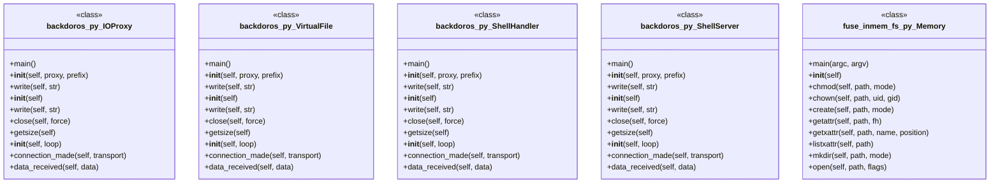

# Polyglot Codebase Knowledge Graph

> Generated offline by **readmenator**. 3 files, 55 symbols, 25 imports. Supports C, C++, Python, Go, Rust, JS/TS, Java, C#, Shell, PHP, Dart, GDScript, Nim, ASM, Ruby, Swift, Kotlin, Scala, Lua, Elixir.
> No LLMs. No tokens. Pure static analysis. See more [here](https://github.com/grisuno/ReadMenator)

**Start here:** Statistics Dashboard for scope, God Nodes for blast radius, Architecture Reference for per-file API. Agents: prefer `readmenator-agent/INDEX.md` + `SYMBOLS.md`.

**Wiki:** prefer `readmenator-wiki/index.md` for progressive disclosure: one synthesis page per community, `connections.json` with EXTRACTED vs INFERRED confidence, `queries.md` log, `REPORT.md` audit.

**Confidence:** EXTRACTED = parsed from source, INFERRED = heuristic bridge, AMBIGUOUS = reported, never hidden. See `readmenator-wiki/REPORT.md`.

**Total Files Parsed:** 3 | **Total Symbols Extracted:** 55 | **Total Imports:** 25

<!-- ranking_model: v1.0 | weights: {ppr:0.45,auth:0.2,test:0.15,doc:0.1,fresh:0.1} | alpha:0.85 | commit:1e0fd0b | date:2026-07-18 -->


## Table of Contents

1. [Statistics Dashboard](#statistics-dashboard)
2. [Architectural Layers](#architectural-layers)
3. [Ranked Context](#ranked-context)
4. [God Nodes](#god-nodes)
5. [Suggested Questions](#suggested-questions)
6. [Taint Propagation Map](#taint-propagation-map)
7. [Hotspot Analysis](#hotspot-analysis)
8. [Change Impact Analysis](#change-impact-analysis)
9. [Suggested Linting Rules](#suggested-linting-rules)
10. [Dataflow Analysis](#dataflow-analysis)
11. [Concept Graph](#concept-graph)
12. [Orphans](#orphans)
13. [Query Recipes](#query-recipes)
14. [Structural Knowledge Map](#structural-knowledge-map)
15. [UML Class Diagram](#uml-class-diagram)
16. [Code Property Graph](#code-property-graph)
17. [Architecture Reference](#architecture-reference)
    - [PY (3 files)](#py-3-files)

---

## Statistics Dashboard

| Metric | Value |
|--------|-------|
| Total Files | 3 |
| Total Symbols | 55 |
| Total Imports | 25 |
| Call Edges | 136 |
| Inheritance Edges | 3 |
| Languages | 1 |
| Avg Symbols/File | 18.3 |
| Avg Imports/File | 8.3 |

### Top Files by Import Count (Fan-Out)

| File | Imports | Symbols | Language |
|------|---------|---------|----------|
| `backdoros.py` | 15 | 29 | py |
| `fuse_inmem_fs.py` | 7 | 24 | py |
| `getbanners.py` | 3 | 2 | py |

---

## Architectural Layers

Auto-detected from path patterns, naming conventions, and imported frameworks.

| Layer | Files |
|-------|-------|
| utility | 3 |

### utility

- `backdoros.py` (py, 29 symbols)
- `fuse_inmem_fs.py` (py, 24 symbols)
- `getbanners.py` (py, 2 symbols)

---

## Ranked Context

Files ranked by composite score for the current query context. The ranking combines Personalized PageRank (query relevance), global authority, test coverage, documentation coverage, and code freshness. Model: v1.0.

| Rank | File | Composite | PPR | Authority | Test | Doc |
|------|------|-----------|-----|-----------|------|-----|
| 1 | `getbanners.py` | 0.0500 | 0.0000 | 0.0000 | 0.00 | 0.50 |
| 2 | `fuse_inmem_fs.py` | 0.0083 | 0.0000 | 0.0000 | 0.00 | 0.08 |
| 3 | `backdoros.py` | 0.0000 | 0.0000 | 0.0000 | 0.00 | 0.00 |

---

## God Nodes

Most architecturally central files ranked by combined import/export degree and symbol richness.

| File | Score | Connections | PageRank |
|------|-------|-------------|----------|
| `backdoros.py` | 2.9 | | 0.0000 |
| `fuse_inmem_fs.py` | 2.4 | | 0.0000 |
| `getbanners.py` | 0.2 | | 0.0000 |

---

## Suggested Questions

Auto-generated exploration prompts based on graph structure:

- What does backdoros.py depend on, and what depends on it? (0 connections)
- What does fuse_inmem_fs.py depend on, and what depends on it? (0 connections)
- What does getbanners.py depend on, and what depends on it? (0 connections)
- What is IOProxy in backdoros.py and how is it used?
- What is Memory in fuse_inmem_fs.py and how is it used?

---

## Taint Propagation Map

Taint analysis traces how dangerous imports propagate through the codebase via transitive dependencies. Source files import dangerous modules directly; sink files receive the danger indirectly.

**Taint Sources:** 1 | **Taint Sinks:** 1 | **Propagation Paths:** 2

- `backdoros.py` imports `urllib.request` (0 hop to `backdoros.py`) [medium]
  Path: backdoros.py
- `backdoros.py` imports `subprocess` (0 hop to `backdoros.py`) [high]
  Path: backdoros.py

---

## Hotspot Analysis

Files ranked by combined complexity (symbol count) and centrality (connection count). High-scoring files are architecturally critical and may need refactoring attention.

| File | Complexity | Centrality | Combined | Symbols | Connections |
|------|-----------|------------|----------|---------|-------------|
| `getbanners.py` | 0.069 | 0.200 | 0.148 | 2 | 3 |
| `fuse_inmem_fs.py` | 0.828 | 0.467 | 0.611 | 24 | 7 |
| `backdoros.py` | 1.000 | 1.000 | 1.000 | 29 | 15 |

---

## Dataflow Analysis

Procedural intra-function dataflow findings (zero tokens, regex-based heuristics, all INFERRED). Each lead is grounded at file:line for manual review.

**2 findings** (UNCHECKED_ALLOC: 2).

| File | Function | Line | Kind | Variable | Description |
|------|----------|------|------|----------|-------------|
| `backdoros.py` | `_do_WRITE` | 152 | `UNCHECKED_ALLOC` | `output_data` | Result of allocator stored in `output_data` is never checked against NULL. |
| `getbanners.py` | `main` | 69 | `UNCHECKED_ALLOC` | `s` | Result of allocator stored in `s` is never checked against NULL. |

---

## Concept Graph

Semantic second-brain layer: nouns are concept nodes, verbs are edges. Each noun maps atomically to a file set (EXTRACTED); each verb aggregates structural imports, calls, and inherits into consumes, invokes, extends, depends_on, or bridges (INFERRED).

**50 concepts, 0 relations.**

| Concept | Files | Mentions |
|---------|-------|----------|
| `copyright` | 2 | 12 |
| `conditions` | 2 | 6 |
| `contributors` | 2 | 6 |
| `following` | 2 | 6 |
| `provided` | 2 | 6 |
| `above` | 2 | 4 |
| `any` | 2 | 4 |
| `binary` | 2 | 4 |
| `but` | 2 | 4 |
| `disclaimer` | 2 | 4 |
| `holder` | 2 | 4 |
| `implied` | 2 | 4 |
| `including` | 2 | 4 |
| `limited` | 2 | 4 |
| `list` | 2 | 4 |
| `must` | 2 | 4 |
| `not` | 2 | 4 |
| `notice` | 2 | 4 |
| `redistributions` | 2 | 4 |
| `software` | 2 | 4 |
| `source` | 2 | 4 |
| `warranties` | 2 | 4 |
| `without` | 2 | 4 |
| `write` | 2 | 4 |
| `all` | 2 | 2 |
| `breach` | 2 | 2 |
| `code` | 2 | 2 |
| `consequential` | 2 | 2 |
| `create` | 2 | 2 |
| `damages` | 2 | 2 |

### Dialectic Prompts

- Thesis: `above` centralizes 2 files; Antithesis: `all` pulls 2 files with 2 shared (Jaccard 1.00); Synthesis: should they merge, split by layer, or keep `bridges` explicit?
- Thesis: `above` centralizes 2 files; Antithesis: `any` pulls 2 files with 2 shared (Jaccard 1.00); Synthesis: should they merge, split by layer, or keep `bridges` explicit?
- Thesis: `above` centralizes 2 files; Antithesis: `binary` pulls 2 files with 2 shared (Jaccard 1.00); Synthesis: should they merge, split by layer, or keep `bridges` explicit?
- Thesis: `above` centralizes 2 files; Antithesis: `breach` pulls 2 files with 2 shared (Jaccard 1.00); Synthesis: should they merge, split by layer, or keep `bridges` explicit?
- Thesis: `above` centralizes 2 files; Antithesis: `but` pulls 2 files with 2 shared (Jaccard 1.00); Synthesis: should they merge, split by layer, or keep `bridges` explicit?
- Thesis: `above` centralizes 2 files; Antithesis: `code` pulls 2 files with 2 shared (Jaccard 1.00); Synthesis: should they merge, split by layer, or keep `bridges` explicit?
- Thesis: `above` centralizes 2 files; Antithesis: `conditions` pulls 2 files with 2 shared (Jaccard 1.00); Synthesis: should they merge, split by layer, or keep `bridges` explicit?
- Thesis: `above` centralizes 2 files; Antithesis: `consequential` pulls 2 files with 2 shared (Jaccard 1.00); Synthesis: should they merge, split by layer, or keep `bridges` explicit?
- Thesis: `above` centralizes 2 files; Antithesis: `contributors` pulls 2 files with 2 shared (Jaccard 1.00); Synthesis: should they merge, split by layer, or keep `bridges` explicit?
- Thesis: `above` centralizes 2 files; Antithesis: `copyright` pulls 2 files with 2 shared (Jaccard 1.00); Synthesis: should they merge, split by layer, or keep `bridges` explicit?

---

## Change Impact Analysis

Files sorted by how many other files would be affected if they changed. High-impact files should be changed with caution.

| File | Direct Dependents | Transitive Dependents | Total Impact |
|------|------------------|----------------------|--------------|
| `backdoros.py` | 0 | 0 | 0 |
| `fuse_inmem_fs.py` | 0 | 0 | 0 |
| `getbanners.py` | 0 | 0 | 0 |

---

## Suggested Linting Rules

Automatically suggested linting and security rules based on patterns detected in the codebase. These can be exported as Semgrep rules using the `--export-rules` flag.

| Rule ID | Severity | Description | Language | Matches |
|---------|----------|-------------|----------|---------|
| `RM001` | info | Large number of functions in py: 50 total | py | 50 |
| `RM002` | info | Print statement found (consider logging instead) | python | 5 |

---

## Orphans

Files with no documentation or low connectivity. These are candidates for documentation investment or cleanup.

- `backdoros.py` (29 symbols, no doc)

---

## Query Recipes

Example queries you can run against this knowledge base using the ranking engine:

```
# Find files most relevant to a concept
readmenator query "Where is the import resolver implemented?"

# Rank files by relevance to a topic
readmenator query "How does documentation generation work?"

# Explain why a file ranks highly
readmenator query "explain readmenator/_documentation.py"

# Trace dependency paths with ranked context
readmenator query "path from CLI to exporter"
```

The ranking model uses the following signals:

- **Personalized PageRank** (45% weight): query-specific relevance via seed propagation
- **Global Authority** (20% weight): structural importance via standard PageRank
- **Test Coverage** (15% weight): fraction of symbols referenced in test files
- **Doc Coverage** (10% weight): presence of docstrings and file-level docs
- **Freshness** (10% weight): recent modification activity

Results include score decomposition and justification paths for each ranked item.

---

## Structural Knowledge Map

```mermaid
graph TD
    classDef mod fill:#1e1e1e,stroke:#ff6666,stroke-width:2px,color:#fff;
    classDef cls fill:#2d2d2d,stroke:#4ec9b0,stroke-width:2px,color:#fff;
    classDef fn fill:#333,stroke:#dcdcaa,stroke-width:1px,color:#dcdcaa;
    classDef ext fill:#111,stroke:#666,stroke-dasharray:5 5,color:#aaa;
    backdoros_py["backdoros.py (py)"]
    class backdoros_py mod;
    backdoros_py_IOProxy["IOProxy"]
    class backdoros_py_IOProxy cls;
    backdoros_py --> backdoros_py_IOProxy
    backdoros_py_VirtualFile["VirtualFile"]
    class backdoros_py_VirtualFile cls;
    backdoros_py --> backdoros_py_VirtualFile
    backdoros_py_ShellHandler["ShellHandler"]
    class backdoros_py_ShellHandler cls;
    backdoros_py --> backdoros_py_ShellHandler
    backdoros_py_ShellServer["ShellServer"]
    class backdoros_py_ShellServer cls;
    backdoros_py --> backdoros_py_ShellServer
    backdoros_py_main["main"]
    class backdoros_py_main fn;
    backdoros_py --> backdoros_py_main
    fuse_inmem_fs_py["fuse_inmem_fs.py (py)"]
    class fuse_inmem_fs_py mod;
    getbanners_py["getbanners.py (py)"]
    class getbanners_py mod;
    ext_sys["sys"]
    class ext_sys ext;
    backdoros_py -.->|imports| ext_sys
    ext_socket["socket"]
    class ext_socket ext;
    backdoros_py -.->|imports| ext_socket
    ext_importlib_util["importlib.util"]
    class ext_importlib_util ext;
    backdoros_py -.->|imports| ext_importlib_util
    ext_asyncio["asyncio"]
    class ext_asyncio ext;
    backdoros_py -.->|imports| ext_asyncio
    ext_io["io"]
    class ext_io ext;
    backdoros_py -.->|imports| ext_io
    ext_platform["platform"]
    class ext_platform ext;
    backdoros_py -.->|imports| ext_platform
    ext_urllib_request["urllib.request"]
    class ext_urllib_request ext;
    backdoros_py -.->|imports| ext_urllib_request
    ext_datetime["datetime"]
    class ext_datetime ext;
    backdoros_py -.->|imports| ext_datetime
    ext_subprocess["subprocess"]
    class ext_subprocess ext;
    backdoros_py -.->|imports| ext_subprocess
    ext_getpass["getpass"]
    class ext_getpass ext;
    backdoros_py -.->|imports| ext_getpass
    ext_os["os"]
    class ext_os ext;
    backdoros_py -.->|imports| ext_os
    ext_shlex["shlex"]
    class ext_shlex ext;
    backdoros_py -.->|imports| ext_shlex
    ext_multiprocessing["multiprocessing"]
    class ext_multiprocessing ext;
    backdoros_py -.->|imports| ext_multiprocessing
    ext_code["code"]
    class ext_code ext;
    backdoros_py -.->|imports| ext_code
    ext_warnings["warnings"]
    class ext_warnings ext;
    backdoros_py -.->|imports| ext_warnings
    fuse_inmem_fs_py -.->|imports| ext_sys
    ext_logging["logging"]
    class ext_logging ext;
    fuse_inmem_fs_py -.->|imports| ext_logging
    ext_collections["collections"]
    class ext_collections ext;
    fuse_inmem_fs_py -.->|imports| ext_collections
    ext_errno["errno"]
    class ext_errno ext;
    fuse_inmem_fs_py -.->|imports| ext_errno
    ext_stat["stat"]
    class ext_stat ext;
    fuse_inmem_fs_py -.->|imports| ext_stat
    ext_time["time"]
    class ext_time ext;
    fuse_inmem_fs_py -.->|imports| ext_time
    ext_fuse["fuse"]
    class ext_fuse ext;
    fuse_inmem_fs_py -.->|imports| ext_fuse
    getbanners_py -.->|imports| ext_socket
    getbanners_py -.->|imports| ext_sys
    getbanners_py -.->|imports| ext_os
```



---

## UML Class Diagram

Auto-generated Mermaid class diagram from parsed class-level symbols. Shows classes, structs, interfaces, traits, and their methods with inheritance and dependency relationships.



---

## Code Property Graph

Machine-readable Code Property Graph (CPG) in JSON-LD format. This block allows AI agents to parse the full structural graph without additional file reads. Compatible with GraphRAG pipelines.

```json
{"@context": "https://schema.org", "analysis": {"communities": [], "god_nodes": [{"node_id": "backdoros.py", "score": 2.9}, {"node_id": "fuse_inmem_fs.py", "score": 2.4}, {"node_id": "getbanners.py", "score": 0.2}], "surprising_connections": []}, "edges": [{"confidence": "EXTRACTED", "relation": "imports", "source": "backdoros.py", "target": "sys"}, {"confidence": "EXTRACTED", "relation": "imports", "source": "backdoros.py", "target": "socket"}, {"confidence": "EXTRACTED", "relation": "imports", "source": "backdoros.py", "target": "importlib.util"}, {"confidence": "EXTRACTED", "relation": "imports", "source": "backdoros.py", "target": "asyncio"}, {"confidence": "EXTRACTED", "relation": "imports", "source": "backdoros.py", "target": "io"}, {"confidence": "EXTRACTED", "relation": "imports", "source": "backdoros.py", "target": "platform"}, {"confidence": "EXTRACTED", "relation": "imports", "source": "backdoros.py", "target": "urllib.request"}, {"confidence": "EXTRACTED", "relation": "imports", "source": "backdoros.py", "target": "datetime"}, {"confidence": "EXTRACTED", "relation": "imports", "source": "backdoros.py", "target": "subprocess"}, {"confidence": "EXTRACTED", "relation": "imports", "source": "backdoros.py", "target": "getpass"}, {"confidence": "EXTRACTED", "relation": "imports", "source": "backdoros.py", "target": "os"}, {"confidence": "EXTRACTED", "relation": "imports", "source": "backdoros.py", "target": "shlex"}, {"confidence": "EXTRACTED", "relation": "imports", "source": "backdoros.py", "target": "multiprocessing"}, {"confidence": "EXTRACTED", "relation": "imports", "source": "backdoros.py", "target": "code"}, {"confidence": "EXTRACTED", "relation": "imports", "source": "backdoros.py", "target": "warnings"}, {"confidence": "EXTRACTED", "relation": "imports", "source": "fuse_inmem_fs.py", "target": "sys"}, {"confidence": "EXTRACTED", "relation": "imports", "source": "fuse_inmem_fs.py", "target": "logging"}, {"confidence": "EXTRACTED", "relation": "imports", "source": "fuse_inmem_fs.py", "target": "collections"}, {"confidence": "EXTRACTED", "relation": "imports", "source": "fuse_inmem_fs.py", "target": "errno"}, {"confidence": "EXTRACTED", "relation": "imports", "source": "fuse_inmem_fs.py", "target": "stat"}, {"confidence": "EXTRACTED", "relation": "imports", "source": "fuse_inmem_fs.py", "target": "time"}, {"confidence": "EXTRACTED", "relation": "imports", "source": "fuse_inmem_fs.py", "target": "fuse"}, {"confidence": "EXTRACTED", "relation": "imports", "source": "getbanners.py", "target": "socket"}, {"confidence": "EXTRACTED", "relation": "imports", "source": "getbanners.py", "target": "sys"}, {"confidence": "EXTRACTED", "relation": "imports", "source": "getbanners.py", "target": "os"}], "generator": "readmenator", "metadata": {"edge_count": 164, "file_count": 3, "language_count": 1, "symbol_count": 55}, "nodes": [{"id": "backdoros.py", "kind": "module", "label": "backdoros.py", "language": "py", "sha256": "9e09d6f3091d54d8", "symbol_count": 29, "symbols": [{"kind": "class", "line": 37, "name": "IOProxy", "signature": "class IOProxy"}, {"kind": "class", "line": 49, "name": "VirtualFile", "signature": "class VirtualFile(StringIO)"}, {"kind": "class", "line": 69, "name": "ShellHandler", "signature": "class ShellHandler(Protocol)"}, {"kind": "class", "line": 197, "name": "ShellServer", "signature": "class ShellServer"}, {"kind": "method", "line": 216, "name": "main", "signature": "def main()"}, {"kind": "method", "line": 38, "name": "__init__", "signature": "def __init__(self, proxy, prefix)"}, {"kind": "method", "line": 42, "name": "write", "signature": "def write(self, str)"}, {"kind": "method", "line": 50, "name": "__init__", "signature": "def __init__(self)"}, {"kind": "method", "line": 54, "name": "write", "signature": "def write(self, str)"}, {"kind": "method", "line": 60, "name": "close", "signature": "def close(self, force)"}, {"kind": "method", "line": 66, "name": "getsize", "signature": "def getsize(self)"}, {"kind": "method", "line": 70, "name": "__init__", "signature": "def __init__(self, loop)"}, {"kind": "method", "line": 83, "name": "connection_made", "signature": "def connection_made(self, transport)"}, {"kind": "method", "line": 87, "name": "data_received", "signature": "def data_received(self, data)"}, {"kind": "method", "line": 91, "name": "process_buffer", "signature": "def process_buffer(self)"}, {"kind": "method", "line": 96, "name": "parse", "signature": "def parse(self, data)"}, {"kind": "method", "line": 142, "name": "_unknown_command", "signature": "def _unknown_command(self, params)"}, {"kind": "method", "line": 145, "name": "_do_WRITE", "signature": "def _do_WRITE(self, params)"}, {"kind": "method", "line": 157, "name": "_do_READ", "signature": "def _do_READ(self, params)"}, {"kind": "method", "line": 163, "name": "_do_DELETE", "signature": "def _do_DELETE(self, params)"}, {"kind": "method", "line": 170, "name": "_do_DIR", "signature": "def _do_DIR(self, params)"}, {"kind": "method", "line": 175, "name": "_do_HELP", "signature": "def _do_HELP(self, params)"}, {"kind": "method", "line": 181, "name": "_do_QUIT", "signature": "def _do_QUIT(self, params)"}, {"kind": "method", "line": 185, "name": "_do_REBOOT", "signature": "def _do_REBOOT(self, params)"}, {"kind": "method", "line": 188, "name": "_do_SHUTDOWN", "signature": "def _do_SHUTDOWN(self, params)"}, {"kind": "method", "line": 193, "name": "_do_UPTIME", "signature": "def _do_UPTIME(self, params)"}, {"kind": "method", "line": 198, "name": "__init__", "signature": "def __init__(self, host, port)"}, {"kind": "method", "line": 202, "name": "start_server", "signature": "def start_server(self)"}, {"kind": "method", "line": 207, "name": "create_shell_handler", "signature": "def create_shell_handler(self, reader, writer)"}]}, {"doc": "Copyright (c) 2019, SafeBreach All rights reserved.  Redistribution and use in source and binary forms, with or without modification, are permitted provided that the following conditions are met:  1. Redistributions of source code must retain the above copyright notice, this list of conditions and the following disclaimer.  2. Redistributions in binary form must reproduce the above copyright notice, this list of conditions and the following disclaimer in the documentation and/or other materials provided with the distribution.  3. Neither the name of the copyright holder nor the names of its contributors may be used to endorse or promote products derived from this software without specific prior written permission.  THIS SOFTWARE IS PROVIDED BY THE COPYRIGHT HOLDERS AND CONTRIBUTORS \"AS IS\" AND ANY EXPRESS OR IMPLIED WARRANTIES, INCLUDING, BUT NOT LIMITED TO, THE IMPLIED WARRANTIES OF MERCHANTABILITY AND FITNESS FOR A PARTICULAR PURPOSE ARE DISCLAIMED. IN NO EVENT SHALL THE COPYRIGHT HOLDER OR CONTRIBUTORS BE LIABLE FOR ANY DIRECT, INDIRECT, INCIDENTAL, SPECIAL, EXEMPLARY, OR CONSEQUENTIAL DAMAGES (INCLUDING, BUT NOT LIMITED TO, PROCUREMENT OF SUBSTITUTE", "id": "fuse_inmem_fs.py", "kind": "module", "label": "fuse_inmem_fs.py", "language": "py", "sha256": "94e81bf61c957cfd", "symbol_count": 24, "symbols": [{"doc": "Example memory filesystem. Supports only one level of files.", "kind": "class", "line": 61, "name": "Memory", "signature": "class Memory(Operations)"}, {"kind": "method", "line": 199, "name": "main", "signature": "def main(argc, argv)"}, {"kind": "method", "line": 64, "name": "__init__", "signature": "def __init__(self)"}, {"kind": "method", "line": 76, "name": "chmod", "signature": "def chmod(self, path, mode)"}, {"kind": "method", "line": 81, "name": "chown", "signature": "def chown(self, path, uid, gid)"}, {"kind": "method", "line": 85, "name": "create", "signature": "def create(self, path, mode)"}, {"kind": "method", "line": 97, "name": "getattr", "signature": "def getattr(self, path, fh)"}, {"kind": "method", "line": 103, "name": "getxattr", "signature": "def getxattr(self, path, name, position)"}, {"kind": "method", "line": 111, "name": "listxattr", "signature": "def listxattr(self, path)"}, {"kind": "method", "line": 115, "name": "mkdir", "signature": "def mkdir(self, path, mode)"}, {"kind": "method", "line": 126, "name": "open", "signature": "def open(self, path, flags)"}, {"kind": "method", "line": 130, "name": "read", "signature": "def read(self, path, size, offset, fh)"}, {"kind": "method", "line": 133, "name": "readdir", "signature": "def readdir(self, path, fh)"}, {"kind": "method", "line": 136, "name": "readlink", "signature": "def readlink(self, path)"}, {"kind": "method", "line": 139, "name": "removexattr", "signature": "def removexattr(self, path, name)"}, {"kind": "method", "line": 147, "name": "rename", "signature": "def rename(self, old, new)"}, {"kind": "method", "line": 151, "name": "rmdir", "signature": "def rmdir(self, path)"}, {"kind": "method", "line": 156, "name": "setxattr", "signature": "def setxattr(self, path, name, value, options, position)"}, {"kind": "method", "line": 161, "name": "statfs", "signature": "def statfs(self, path)"}, {"kind": "method", "line": 164, "name": "symlink", "signature": "def symlink(self, target, source)"}, {"kind": "method", "line": 172, "name": "truncate", "signature": "def truncate(self, path, length, fh)"}, {"kind": "method", "line": 178, "name": "unlink", "signature": "def unlink(self, path)"}, {"kind": "method", "line": 182, "name": "utimens", "signature": "def utimens(self, path, times)"}, {"kind": "method", "line": 188, "name": "write", "signature": "def write(self, path, data, offset, fh)"}]}, {"doc": "Copyright (c) 2019, SafeBreach All rights reserved.  Redistribution and use in source and binary forms, with or without modification, are permitted provided that the following conditions are met:  1. Redistributions of source code must retain the above copyright notice, this list of conditions and the following disclaimer.  2. Redistributions in binary form must reproduce the above copyright notice, this list of conditions and the following disclaimer in the documentation and/or other materials provided with the distribution.  3. Neither the name of the copyright holder nor the names of its contributors may be used to endorse or promote products derived from this software without specific prior written permission.  THIS SOFTWARE IS PROVIDED BY THE COPYRIGHT HOLDERS AND CONTRIBUTORS \"AS IS\" AND ANY EXPRESS OR IMPLIED WARRANTIES, INCLUDING, BUT NOT LIMITED TO, THE IMPLIED WARRANTIES OF MERCHANTABILITY AND FITNESS FOR A PARTICULAR PURPOSE ARE DISCLAIMED. IN NO EVENT SHALL THE COPYRIGHT HOLDER OR CONTRIBUTORS BE LIABLE FOR ANY DIRECT, INDIRECT, INCIDENTAL, SPECIAL, EXEMPLARY, OR CONSEQUENTIAL DAMAGES (INCLUDING, BUT NOT LIMITED TO, PROCUREMENT OF SUBSTITUTE", "id": "getbanners.py", "kind": "module", "label": "getbanners.py", "language": "py", "sha256": "82a3ad65422d82c8", "symbol_count": 2, "symbols": [{"kind": "function", "line": 54, "name": "slugify", "signature": "def slugify(input)"}, {"kind": "function", "line": 58, "name": "main", "signature": "def main(argc, argv)"}]}], "type": "CodePropertyGraph", "version": "1.0"}
```

---

## Architecture Reference

### PY (3 files)

#### `backdoros.py`
**Path:** `backdoros.py`

**Classes:**
- `IOProxy` (line 37) `class IOProxy`
- `VirtualFile` (line 49) `class VirtualFile(StringIO)`
- `ShellHandler` (line 69) `class ShellHandler(Protocol)`
- `ShellServer` (line 197) `class ShellServer`

**Methods:**
- `main` (line 216) `def main()`
- `__init__` (line 38) `def __init__(self, proxy, prefix)`
- `write` (line 42) `def write(self, str)`
- `__init__` (line 50) `def __init__(self)`
- `write` (line 54) `def write(self, str)`
- `close` (line 60) `def close(self, force)`
- `getsize` (line 66) `def getsize(self)`
- `__init__` (line 70) `def __init__(self, loop)`
- `connection_made` (line 83) `def connection_made(self, transport)`
- `data_received` (line 87) `def data_received(self, data)`
- `process_buffer` (line 91) `def process_buffer(self)`
- `parse` (line 96) `def parse(self, data)`
- `_unknown_command` (line 142) `def _unknown_command(self, params)`
- `_do_WRITE` (line 145) `def _do_WRITE(self, params)`
- `_do_READ` (line 157) `def _do_READ(self, params)`
- `_do_DELETE` (line 163) `def _do_DELETE(self, params)`
- `_do_DIR` (line 170) `def _do_DIR(self, params)`
- `_do_HELP` (line 175) `def _do_HELP(self, params)`
- `_do_QUIT` (line 181) `def _do_QUIT(self, params)`
- `_do_REBOOT` (line 185) `def _do_REBOOT(self, params)`
- `_do_SHUTDOWN` (line 188) `def _do_SHUTDOWN(self, params)`
- `_do_UPTIME` (line 193) `def _do_UPTIME(self, params)`
- `__init__` (line 198) `def __init__(self, host, port)`
- `start_server` (line 202) `def start_server(self)`
- `create_shell_handler` (line 207) `def create_shell_handler(self, reader, writer)`

#### `fuse_inmem_fs.py`
**Path:** `fuse_inmem_fs.py`
**File Doc:** *Copyright (c) 2019, SafeBreach All rights reserved.  Redistribution and use in source and binary forms, with or without modification, are permitted provided that the following conditions are met:  1. Redistributions of source code must retain the above copyright notice, this list of conditions and the following disclaimer.  2. Redistributions in binary form must reproduce the above copyright notice, this list of conditions and the following disclaimer in the documentation and/or other materials provided with the distribution.  3. Neither the name of the copyright holder nor the names of its contributors may be used to endorse or promote products derived from this software without specific prior written permission.  THIS SOFTWARE IS PROVIDED BY THE COPYRIGHT HOLDERS AND CONTRIBUTORS "AS IS" AND ANY EXPRESS OR IMPLIED WARRANTIES, INCLUDING, BUT NOT LIMITED TO, THE IMPLIED WARRANTIES OF MERCHANTABILITY AND FITNESS FOR A PARTICULAR PURPOSE ARE DISCLAIMED. IN NO EVENT SHALL THE COPYRIGHT HOLDER OR CONTRIBUTORS BE LIABLE FOR ANY DIRECT, INDIRECT, INCIDENTAL, SPECIAL, EXEMPLARY, OR CONSEQUENTIAL DAMAGES (INCLUDING, BUT NOT LIMITED TO, PROCUREMENT OF SUBSTITUTE*

**Classes:**
- `Memory` (line 61) `class Memory(Operations)` - *Example memory filesystem. Supports only one level of files.*

**Methods:**
- `main` (line 199) `def main(argc, argv)`
- `__init__` (line 64) `def __init__(self)`
- `chmod` (line 76) `def chmod(self, path, mode)`
- `chown` (line 81) `def chown(self, path, uid, gid)`
- `create` (line 85) `def create(self, path, mode)`
- `getattr` (line 97) `def getattr(self, path, fh)`
- `getxattr` (line 103) `def getxattr(self, path, name, position)`
- `listxattr` (line 111) `def listxattr(self, path)`
- `mkdir` (line 115) `def mkdir(self, path, mode)`
- `open` (line 126) `def open(self, path, flags)`
- `read` (line 130) `def read(self, path, size, offset, fh)`
- `readdir` (line 133) `def readdir(self, path, fh)`
- `readlink` (line 136) `def readlink(self, path)`
- `removexattr` (line 139) `def removexattr(self, path, name)`
- `rename` (line 147) `def rename(self, old, new)`
- `rmdir` (line 151) `def rmdir(self, path)`
- `setxattr` (line 156) `def setxattr(self, path, name, value, options, position)`
- `statfs` (line 161) `def statfs(self, path)`
- `symlink` (line 164) `def symlink(self, target, source)`
- `truncate` (line 172) `def truncate(self, path, length, fh)`
- `unlink` (line 178) `def unlink(self, path)`
- `utimens` (line 182) `def utimens(self, path, times)`
- `write` (line 188) `def write(self, path, data, offset, fh)`

#### `getbanners.py`
**Path:** `getbanners.py`
**File Doc:** *Copyright (c) 2019, SafeBreach All rights reserved.  Redistribution and use in source and binary forms, with or without modification, are permitted provided that the following conditions are met:  1. Redistributions of source code must retain the above copyright notice, this list of conditions and the following disclaimer.  2. Redistributions in binary form must reproduce the above copyright notice, this list of conditions and the following disclaimer in the documentation and/or other materials provided with the distribution.  3. Neither the name of the copyright holder nor the names of its contributors may be used to endorse or promote products derived from this software without specific prior written permission.  THIS SOFTWARE IS PROVIDED BY THE COPYRIGHT HOLDERS AND CONTRIBUTORS "AS IS" AND ANY EXPRESS OR IMPLIED WARRANTIES, INCLUDING, BUT NOT LIMITED TO, THE IMPLIED WARRANTIES OF MERCHANTABILITY AND FITNESS FOR A PARTICULAR PURPOSE ARE DISCLAIMED. IN NO EVENT SHALL THE COPYRIGHT HOLDER OR CONTRIBUTORS BE LIABLE FOR ANY DIRECT, INDIRECT, INCIDENTAL, SPECIAL, EXEMPLARY, OR CONSEQUENTIAL DAMAGES (INCLUDING, BUT NOT LIMITED TO, PROCUREMENT OF SUBSTITUTE*

**Functions:**
- `slugify` (line 54) `def slugify(input)`
- `main` (line 58) `def main(argc, argv)`
